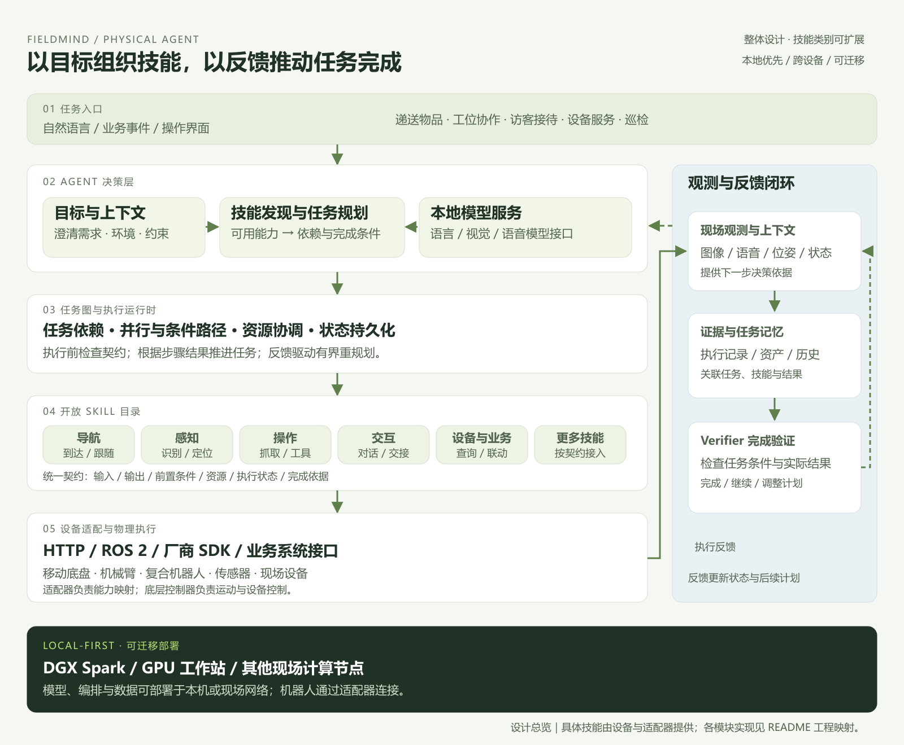
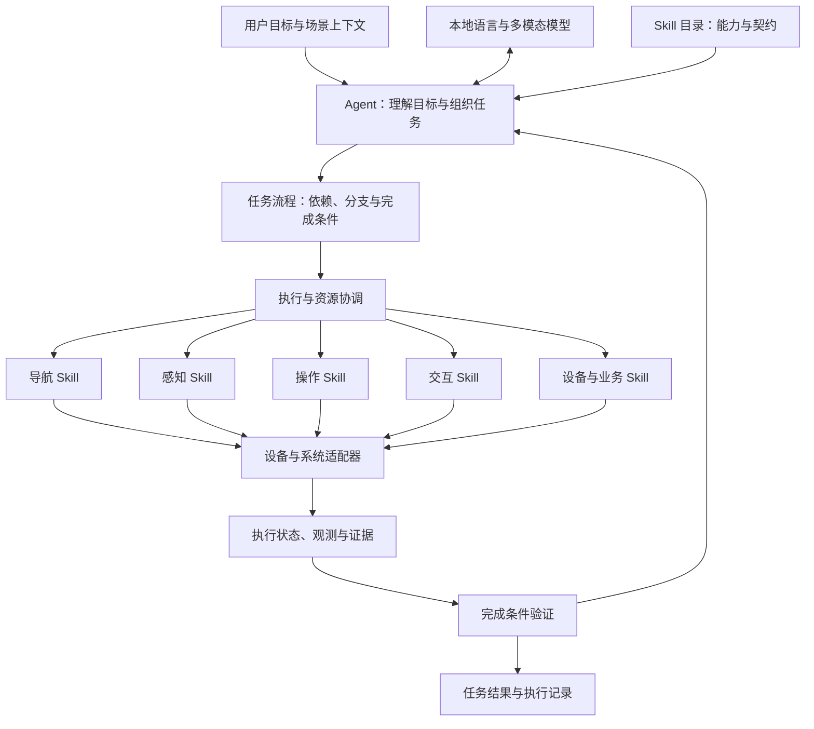

# FieldMind

### 把机器人的每一种能力，编排成完成任务的行动。

**面向多场景任务的机器人 Agent 与技能编排系统 · Local-first Physical Agent & Skill Orchestration**

FieldMind 的核心理念是：将机器人具备的导航、感知、操作、交互以及其他设备能力统一表达为 Skill，由 Agent 围绕任务目标选择、组合和协调这些技能。任务决定技能如何组织，机器人与现场环境决定有哪些技能可用，同一项能力可以在不同场景中反复复用。

从物品递送、工位协作到接待引导、设备服务，产品围绕“目标理解 → 技能编排 → 现场执行 → 反馈与验证”组织任务。导航巡检是其中一条应用流程，抓取、放置、对话、设备调用等能力同样属于这一架构的技能空间。

系统采用可迁移、本地优先的部署思路，模型可以部署在 DGX Spark、GPU 工作站或其他满足模型运行要求的现场节点。硬件提供算力，Agent 组织任务，Skill 封装能力，设备适配器执行动作，Verifier 检查完成条件与证据。

[核心 Idea](#核心-idea从单项能力走向任务能力) · [技能体系](#技能体系) · [系统架构](#系统架构) · [安装教程](#安装教程) · [文档导览](#文档导览)



[查看高清 PNG](docs/diagrams/fieldmind-overview.png) · [查看可编辑 SVG](docs/diagrams/fieldmind-overview.svg)

## 核心 Idea：从单项能力走向任务能力

### 1. 机器人拥有能力，用户提出目标

一台机器人可能已经能够导航、识别物体、抓取、说话或调用设备，但用户提出的需求通常跨越多项能力。例如“把工具交给 3 号工位的操作员”同时涉及位置、物品、动作、交互和最终交接。真正需要解决的是：如何把分散的能力组织成完整任务，并在环境变化时继续推进。

如果每个业务场景都从头编写专用流程，同一项导航、抓取或交互能力就会在不同项目中反复接线。机器人形态、现场布局或业务规则发生变化时，应用层也需要跟着调整。FieldMind 把复用的单位放在 Skill，把组织的单位放在 Task，让设备能力与任务需求通过统一契约连接。

### 2. 用 Skill 统一表达可执行能力

Skill 可以来自成熟算法、机器人控制器、视觉模型、语音服务或业务接口。它应告诉 Agent：“我能做什么、需要什么输入、占用什么资源、会产生什么结果、怎样判断执行完成。”

例如，`navigate` 接收目的地并返回到达状态；`locate_object` 输出目标位置和参考坐标系；`pick` 消费目标位置并返回抓取状态；`ask_user` 获取缺失信息；`handover` 处理物品交接。这些名称用于说明技能设计，接入时需要绑定具体设备适配器和输出契约。

统一表达意味着 Agent 可以围绕能力进行组合，而设备细节仍由适配器处理。更换底盘或机械臂时，优先替换能力的设备映射；改变任务目标时，优先调整技能组合。迁移过程中仍需核对坐标系、参数含义、资源与完成条件。

### 3. Agent 负责把目标变成任务结构

用户提供目标，Agent 结合已注册技能、场景上下文与执行约束，形成具有依赖关系的任务计划。计划中的节点是技能调用，边表示先后依赖或数据传递；任务还应带有明确的最终完成条件。

“自由编排”的含义是：业务流程不被固定在某一组技能或某一类场景中。编排仍然遵循能力契约：不存在的技能不能调用，未获得的观测不能当作事实，使用同一机械臂的动作需要协调资源。顺序、并行、条件路径与反馈调整属于任务表达设计；具体执行语义由运行器实现。

系统中的职责分工是：Agent 提出计划，契约校验器检查计划，Runtime 管理执行与资源，适配器调用设备，Verifier 检查完成依据。模型的语义判断与运行时的确定性规则共同组成任务闭环。

### 4. 任务执行需要持续接收现实反馈

物体可能被移动，通道可能被占用，人可能暂时离开。一次任务执行因此会不断产生新的事实：导航到了哪里、相机看到了什么、抓取是否成立、用户确认了什么。

FieldMind 的设计将这些反馈关联到任务节点、执行身份和证据资产。后续步骤消费已经成功获得的输出；发生失败或条件变化时，系统可以在明确边界和预算内修订计划，或者请求补充信息。历史计划和已完成动作仍然保留，便于理解整个任务如何走到当前状态。

这也解释了为什么“任务已完成”需要独立定义：递送任务要求交付对象与物品状态一致；工位任务要求目标工序状态达到要求；引导任务要求到达目标地点。验证应根据任务选择控制器反馈、传感器观测、业务记录或人的确认。

### 5. 同一套能力组合成不同场景

以“导航 + 识别 + 抓取 + 对话 + 状态确认”为例：在仓储中可以组合成拣选配送，在制造中可以组合成物料补给，在服务场景中可以组合成寻物递送。加入业务查询、工具操作或设备联动后，可覆盖更多任务。

行业 Skill Pack 的价值在于把常用能力、参数约束、任务模板和完成标准整理为可复用组合。它既保留行业规则，又复用底层能力。产品扩展沿两个方向进行：横向接入更多技能和机器人，纵向积累具体场景的任务流程与验证经验。

### 6. 本地算力承担现场智能，可迁移接口承载产品

机器人任务包含视觉、语言、状态与动作之间的频繁交互。将模型与任务运行时放在现场，可以缩短服务通信路径，并让敏感现场数据留在部署环境内。预先准备好模型与依赖后，现场任务可以减少对公网的依赖。

DGX Spark 在这套设计中承担现场 AI 计算节点的角色，也可以替换为满足模型需求的 GPU 工作站或其他边缘设备。Agent 通过模型接口使用算力，通过 Skill 接口使用机器人能力，因此产品的任务表达与具体硬件解耦。

任务层的决策和底层运动控制保持不同职责：模型处理目标与语义，Runtime 管理任务，机器人控制器负责实时运动。现场算力越充足，越有空间配置更合适的模型与多模态服务；实际性能通过具体部署测试衡量。

### 7. 如何检验这个 Idea 的价值

产品验证应围绕任务本身展开：同一组技能能否复用于多个任务；新增场景需要增加多少专用代码；更换机器人需要修改哪些适配器；任务遇到异常后能否根据真实反馈继续；最终结论能否追溯到实际结果。

这些维度把项目的核心落在“能力复用、任务编排、执行闭环和设备迁移”上。下文中的图像巡检工作台提供了一条具体运行路径，通用编排框架则承担跨场景能力组织。

## 从任务目标出发

“把仓库里的工具箱送到 3 号工位，交给操作员，并确认交接完成。”

这项任务需要多种机器人能力协作：理解物品与目的地、查询工具箱位置、导航、识别与定位、抓取、运输、发起交互、交付物品，以及确认最终状态。换成“引导访客到会议室”，系统需要的技能组合则变成对话、地点查询、导航、跟随状态感知和到达确认。

FieldMind 的产品目标是把这些能力组织为可复用、可组合、可验证的任务流程。新增场景时，围绕目标重组已有技能；接入新设备时，通过适配器扩展可用技能集合。

## 技能体系

Skill 是一项有明确输入、输出、执行条件与完成依据的能力单元。技能目录采用开放设计，以下分类用于说明接入方向，具体可调用能力由设备和适配器提供。

| 技能类别 | 典型能力 | 任务中的作用 |
| --- | --- | --- |
| 移动与导航 | 定点导航、跟随、停靠、位置调整 | 到达执行任务所需的位置 |
| 感知与理解 | 目标识别、物体定位、语音识别、场景理解 | 获取环境、物体和人的状态 |
| 操作与作业 | 抓取、放置、搬运、按压、工具使用 | 改变物体或设备的物理状态 |
| 对话与交互 | 任务澄清、问答、引导、交接确认 | 理解人的需求并协调行动 |
| 设备与业务调用 | 查询库存、调用门禁、操作设备、更新工单 | 连接机器人动作与业务流程 |
| 验证与记录 | 到达确认、物品核对、状态检查、证据保存 | 判断任务是否达到完成条件 |

通用技能契约应描述能力名称、参数、输出、前置条件、所需资源、完成条件及执行状态。例如，抓取需要已定位的目标和可用机械臂；交接需要确认接收对象与物品状态。这些约束让技能组合具有可执行的含义。

## 任务编排

编排架构面向任务依赖组织技能，支持表达顺序执行、独立步骤并行、条件分支和根据反馈调整后续步骤。组合必须满足设备能力、资源占用与前置条件；具体执行支持以接入的运行器和 Skill 契约为准。

以下是任务组合示意，展示同一技能体系如何服务不同需求：

| 任务 | 技能组合示例 | 完成依据 |
| --- | --- | --- |
| 物品递送 | 查询物品 → 导航 → 识别 → 抓取 → 运输 → 交接 | 物品与接收对象确认 |
| 访客接待 | 对话澄清 → 查询地点 → 引导导航 → 到达确认 | 访客到达目标地点 |
| 工位协作 | 理解工序 → 定位工件 → 取放或工具操作 → 状态检查 | 工序对应的状态变化 |
| 设备服务 | 查询设备 → 导航 → 读取状态 → 执行授权操作 → 复核 | 设备状态与操作记录 |
| 现场巡检 | 导航 → 观察 → 分析 → 验证 | 现场图像与检查结果 |

以递送任务为例，物品不明确时先进行对话澄清；目标位置变化时重新感知；接收人暂时不在时根据任务策略选择等待或通知。每条分支仍由可调用 Skill 和明确完成条件构成。

## 为什么选择本地部署

**现场数据留在现场。** 模型部署在本机或受控现场网络时，视觉、语音与任务上下文可以在现场处理。当前图像流程将原始证据写入本地目录。

**减少公网依赖。** 模型权重、推理服务与机器人适配器就绪后，核心任务链可通过本机或现场网络运行，适用于网络条件受限的工作地点。

**缩短交互与决策路径。** 将感知理解和任务编排放在现场节点，减少远端服务的网络往返。任务层 Agent 通过 Skill 调用设备控制器，底层运动控制由对应设备系统承担。

**随场景选择算力。** DGX Spark 是面向本地 AI 的参考部署平台之一。系统也可连接其他 GPU 节点上的模型服务；模型名称、服务地址与机器人适配器均通过配置切换。Agent 运行时本身使用 Python 标准库，算力需求主要来自所选视觉模型。

## 系统架构

通用架构围绕目标、技能和执行反馈组织，各行业共享 Agent 与 Skill 抽象，通过模型和设备适配器接入具体能力。

顶部架构图展示整体设计：主流程从任务入口流向 Agent、任务运行时、Skill 和设备；右侧的观测、证据与完成验证将结果送回决策层；底部标明可迁移的现场部署环境。模型服务和具体机器人能力按部署配置接入。



### 工程模块与职责

| 层次 | 主要代码 | 职责 |
| --- | --- | --- |
| 目标与任务协作 | `goal_analysis.py`、`sessions.py`、`application.py` | 目标分析、会话、计划草稿与操作接口 |
| 模型与规划 | `planner.py`、`model_call.py`、`model_transport.py` | 使用配置模型生成结构化任务计划 |
| 上下文组织 | `context_*.py`、`model_context.py` | 组织任务、资产与观测上下文 |
| 技能与契约 | `skills.py`、`contracts.py`、`completion.py` | 注册能力，检查参数、输出与完成条件 |
| 执行与持久化 | `runtime.py`、`durable.py`、`store.py` | 执行身份、依赖、资源协调、状态与恢复 |
| 设备服务边界 | `service.py`、`fencing.py` | HTTP 技能调用与控制权协议 |
| 资产与记录 | `memory.py`、`recording.py`、`ros_recording.py` | 资产索引、证据关联、MCAP 与 ROS 记录 |
| 操作与观察 | `ui/`、`robot_agent_observer/` | 任务协作界面与执行状态观察 |

表中的 Python 文件位于 `robot_agent/`。通用框架使用 DBOS 管理持久工作流、SQLite 保存任务账本、JSON Schema 校验契约，并通过 MCAP 组织观测记录。设备能力由注册技能和适配器提供。

### 目录结构

```text
AGI_Robort/
├── README.md                 产品 Idea、架构与安装入口
├── fieldmind.py              图像任务工作台入口
├── hackathon_mvp.py          四步图像任务流程与内嵌网页
├── start_fieldmind.sh        Linux 工作台启动脚本
├── robot_agent/              通用 Agent、Skill 与执行框架
├── robot_agent_observer/     观察服务
├── ui/                       React / TypeScript 操作界面
├── examples/                 示例与接入资料
├── tests/                    各模块验证用例
├── docs/                     协议、架构、上下文与验证文档
│   └── diagrams/             架构图与任务流程图
├── pyproject.toml            Python 包与命令行入口
└── requirements.lock         固定版本依赖清单
```

### 已提供的任务入口：图像巡检

仓库中的 `fieldmind.py` 提供一条固定四步图像巡检流程，便于运行和观察目标、Skill、模型与验证器如何协作。上面的技能分类与组合示例描述系统的通用设计和接入方向；此入口的实际调用链如下。

| Skill | 职责 | 输出 |
| --- | --- | --- |
| `robot.navigate` | 将目的地发送到同步机器人适配器；目的地留空时采用当前位置巡检 | 导航状态与适配器提供的证据 |
| `vision.observe` | 接收操作者上传的现场图像并保存 | 文件路径、格式与字节数 |
| `inspection.assess` | 结合巡检目标分析图像 | 状态、摘要、置信度与发现列表 |
| `task.verify` | 校验结构化结果及图像文件 | 验证标记、巡检结论与证据路径 |

此流程的 Verifier 校验结果字段及图像文件存在性和大小。图像语义判断由视觉模型提供，输出 `normal`、`anomaly` 或 `uncertain` 以及模型置信度。其他任务应定义各自的完成条件，例如物品交付状态、操作后的设备状态或人的确认。

## 安装教程

仓库提供两条运行路径：**图像任务工作台**便于直接体验一条完整任务流程；**通用编排框架**用于技能注册、任务 DAG、持久执行与开发接入。两者是独立入口，工作台不会自动启动通用框架的 worker。

### 路径 A：图像任务工作台

### 环境准备

- Python 3.10 或更高版本；运行入口无需安装额外 Python 包。
- 一个支持文本与 `image_url` 输入的 Chat Completions 兼容多模态服务。
- 巡检现场图像，支持 JPEG、PNG、WebP，单张不超过 8 MiB。
- 执行指定目的地导航时，准备同步机器人 Skill 适配器。

获取仓库后，进入包含 `fieldmind.py` 与 `pyproject.toml` 的目录，也就是本 README 所在目录。先运行 `python --version`（Linux 可使用 `python3 --version`）确认 Python 版本。

模型服务需提前准备：选择支持图像输入的模型，启动提供 Chat Completions 兼容接口的推理服务，并记录完整接口地址、服务模型名和可选访问令牌。下面的模型名是配置示例，必须与实际服务一致。启动工作台不会下载模型或启动模型服务。

### Linux / DGX Spark

```bash
python3 -m venv .venv-fieldmind
source .venv-fieldmind/bin/activate
export MODEL_ENDPOINT=http://127.0.0.1:8000/v1/chat/completions
export MODEL_NAME=Qwen/Qwen2.5-VL-7B-Instruct
bash start_fieldmind.sh
```

### Windows PowerShell

```powershell
py -3 -m venv .venv-fieldmind
$env:MODEL_ENDPOINT = "http://127.0.0.1:8000/v1/chat/completions"
$env:MODEL_NAME = "Qwen/Qwen2.5-VL-7B-Instruct"
.\.venv-fieldmind\Scripts\python.exe fieldmind.py --host 127.0.0.1 --port 3030
```

打开 [http://127.0.0.1:3030](http://127.0.0.1:3030)。Linux 启动脚本默认监听 `0.0.0.0`，可从现场网络访问 `http://<edge-host>:3030`。

### 完成一次巡检

1. 输入“检查当前区域的消防通道是否被物品占用”，或选择页面中的巡检预设。
2. 当前位置巡检时保持目的地为空；已接入机器人适配器时可以填写目的地。
3. 上传与本次巡检对应的现场图像，点击“执行端侧巡检”。
4. 查看四步 Skill 状态、判断结果与模型置信度。
5. 展开原始执行记录，查看任务 ID、步骤输出、耗时与图像证据路径。

指定目的地时，应由操作者保证上传图像对应所检查区域。图像在提交时上传，导航适配器负责导航结果，图像来源由当前上传流程管理。

### 路径 B：安装通用编排框架

通用执行进程使用 `fcntl` 文件锁，建议在 Linux、DGX Spark 的 Linux 环境或 Windows WSL2 内运行。以下命令在该 Linux 环境的项目目录执行，与路径 A 的虚拟环境分开：

```bash
python3 -m venv .venv
source .venv/bin/activate
python -m pip install --upgrade pip
python -m pip install -r requirements.lock -e .
robot-agent --help
robot-agent --root .runtime init --allow-read "$PWD"
robot-agent --root .runtime skills
```

`init` 初始化运行目录并设置文件读取范围，`skills` 列出已注册技能。安装 Python 包不会自动提供底盘、机械臂或语音能力；这些能力通过技能协议注册。

通用框架的模型配置使用 JSON 文件，与路径 A 的环境变量配置分开。例如将以下内容保存为 `model-config.json`，按实际模型服务填写：

```json
{
  "endpoint": "http://127.0.0.1:8000/v1/chat/completions",
  "model": "your-served-model-name",
  "timeout": 90
}
```

接入 Skill 后，可先生成计划，再运行执行进程。下面的命令用于查看当前目标在已注册能力下的计划：

```bash
robot-agent --root .runtime plan "整理当前任务需要的现场资料并核验结果" \
  --model-config model-config.json
```

需要鉴权的模型可在配置中增加 `token_env`，其值为保存访问令牌的环境变量名。具体模型与上下文流转见 [模型调用文档](docs/MODEL_CONTEXT_FLOW.md)，技能注册与执行见 [技能协议](docs/SKILL_PROTOCOL.md)。

### 通用框架的 Web 操作界面

`ui/` 是独立的 React 操作界面，图像任务工作台不需要安装它。使用该界面时，准备 Node.js 与 npm，在项目根目录安装并构建：

```bash
npm ci --prefix ui
npm run build --prefix ui
```

按 [应用层部署说明](docs/APPLICATION_LAYER.md) 配置操作身份文件和令牌，再启动应用服务与 worker；两个进程使用同一个运行目录：

```bash
# 终端一：操作服务；先按上述文档准备 application-auth.json
.venv/bin/python -m robot_agent.application --root .runtime \
  --auth-config .runtime/application-auth.json --static ui/dist --port 8768

# 终端二：执行进程
.venv/bin/robot-agent --root .runtime run
```

访问 `http://127.0.0.1:8768`，使用所配置的操作凭据进入任务协作。ROS 观测录制与机器人驱动接入还需要对应机器的 ROS 环境，见 [G1 接入契约](docs/G1_INTEGRATION_CONTRACT.md)。

### 安装后的检查与常见问题

| 现象 | 检查方法 |
| --- | --- |
| 工作台可打开，模型请求失败 | 检查模型进程、完整端点、模型名与 `MODEL_API_KEY` |
| 文本模型能回答，但图像任务失败 | 检查服务是否接受 `image_url`，并返回所要求的 JSON 字段 |
| 填写目的地后导航失败 | 配置 `ROBOT_SKILL_URL`，检查适配器是否返回最终状态及证据 |
| Windows 通用 worker 提示缺少 `fcntl` | 在 WSL2 / Linux 中安装和运行通用框架 |
| 找不到 `robot-agent` 命令 | 激活 `.venv`，或直接使用 `.venv/bin/robot-agent` |
| 固定依赖安装失败 | 检查 Python 版本、软件源和系统架构；查看首条包安装错误 |
| 本机访问被代理影响 | 将 `localhost` 与 `127.0.0.1` 加入代理绕过配置 |

图像任务工作台运行时检查：

```bash
curl --noproxy '*' http://127.0.0.1:3030/api/health
python -m unittest tests.test_hackathon_mvp -v
```

Windows 可以使用 `curl.exe` 与 `.\.venv-fieldmind\Scripts\python.exe` 执行对应命令。健康接口检查运行时响应，实际模型连接通过提交一项图像任务验证。

## 配置

| 配置项 | 默认值 | 用途 |
| --- | --- | --- |
| `MODEL_ENDPOINT` | `http://127.0.0.1:8000/v1/chat/completions` | 完整模型请求地址 |
| `MODEL_NAME` | `Qwen/Qwen2.5-VL-7B-Instruct` | 推理服务中的模型名称 |
| `MODEL_API_KEY` | 空 | 可选模型 Bearer Token |
| `ROBOT_SKILL_URL` | 空 | 同步导航 Skill HTTP 地址 |
| `PORT` | `3030` | `start_fieldmind.sh` 的监听端口 |
| `--host` | `127.0.0.1` | Python 入口的监听地址 |
| `--port` | `3030` | Python 入口的监听端口 |
| `--evidence-root` | `.runtime/hackathon` | 原始图像保存目录 |

自定义证据目录：

```bash
python fieldmind.py --port 3030 --evidence-root ./field-evidence
```

模型地址可以指向本机或网络中的推理节点。选择远端模型服务时，图像会发送到该地址；需要数据留在现场时，应将服务部署在现场环境内。

## 机器人接入

机器人能力通过适配器连接：每项 Skill 对应设备可执行的操作及其结果契约。当前图像巡检入口使用 `ROBOT_SKILL_URL` 接入同步导航服务，在启动 FieldMind 前配置该变量。

请求示例：

```json
{
  "execution_id": "<task-id>:navigate",
  "skill": "robot.navigate",
  "args": {"destination": "A 区"}
}
```

完成响应的结构示例：

```json
{
  "status": "succeeded",
  "evidence": [
    {"source": "controller-log", "reference": "<实际控制器记录标识>"}
  ]
}
```

导航步骤要求响应状态为 `succeeded` 且证据列表非空。适配器负责提供可核对的控制器或传感器记录；运行时据此进入后续步骤。上游请求超时为 90 秒，适配器应在此时间内返回。

## 接口与证据

| 接口 | 用途 |
| --- | --- |
| `GET /` | 现场任务工作台 |
| `GET /api/health` | 运行时状态、模型名称与连接配置 |
| `GET /api/system` | 主机架构和可获取的 GPU 信息 |
| `POST /api/run` | 提交巡检目标、目的地和图像，返回执行结果 |

`POST /api/run` 的请求字段为 `goal`、`destination` 和 `image`，其中 `image` 是 Base64 Data URL。响应包含 `task_id`、`status`、`plan`、`steps`、`error` 与 `elapsed_ms`；调用方应读取响应中的任务状态判断执行结果。

原始图像按任务 ID 写入证据目录。步骤输出和验证结果通过 API 返回，也可在页面展开查看。`/api/health` 表示运行时可响应及其配置，不执行上游模型推理探测。

## 行业扩展

行业 Skill Pack 将可复用技能、业务规则和完成条件组织在一起。相同的导航、识别、取放和交互能力可以组合成不同任务，以下为场景接入方向。

| 行业 | 任务方向 | 技能组合方向 |
| --- | --- | --- |
| 制造 | 工件上下料、物料补给、工位协作 | 工序查询、定位、抓取、放置、质量复核 |
| 仓储物流 | 拣选、搬运、配送、盘点 | 库存查询、导航、识别、取放、交接 |
| 商业与园区 | 接待、引导、物品递送、设施服务 | 对话、地点查询、导航、设备联动、确认 |
| 能源与运维 | 设备检查、工具递送、授权设备操作 | 状态感知、移动、操作、复核、工单更新 |
| 家庭与辅助服务 | 寻物、递物、提醒与日常协助 | 需求澄清、物品识别、取放、跟随、交互 |

扩展路径以 Skill 为单位积累能力，以任务流程为单位复用经验，以设备适配器为边界迁移到不同机器人形态。一个新场景可以复用已有技能组合，一项新技能也可以服务多个行业任务。

## 文档导览

建议阅读顺序：**README 理解 Idea → 整体架构理解职责 → 技能协议实现接入 → 任务与完成契约理解执行 → 验证材料核对部署情况**。

| 文档或入口 | 内容与适用读者 |
| --- | --- |
| [fieldmind.py](fieldmind.py) | 产品启动入口 |
| [start_fieldmind.sh](start_fieldmind.sh) | Linux 启动脚本 |
| [hackathon_mvp.py](hackathon_mvp.py) | 任务编排、Skill、验证器、HTTP 服务与工作台 |
| [HACKATHON.md](HACKATHON.md) | 三分钟展示路径与比赛叙事 |
| [DESIGN.md](DESIGN.md) | 视觉规范与工作台设计 |
| [docs/SKILL_PROTOCOL.md](docs/SKILL_PROTOCOL.md) | 工程技能协议参考 |
| [docs/ARCHITECTURE.md](docs/ARCHITECTURE.md) | 完整工程架构资料 |
| [docs/DETAILED_ARCHITECTURE.md](docs/DETAILED_ARCHITECTURE.md) | 目标分层、组件接口、执行状态与部署关系；适合架构阅读 |
| [docs/TASK_DECOMPOSITION_FLOW.md](docs/TASK_DECOMPOSITION_FLOW.md) | 自然语言目标如何进入规划、契约检查与执行链 |
| [docs/COMPLETION_CONTRACTS.md](docs/COMPLETION_CONTRACTS.md) | 任务完成标准、验证节点与结果检查 |
| [docs/MODEL_CONTEXT_FLOW.md](docs/MODEL_CONTEXT_FLOW.md) | 模型配置、上下文组织、历史与重规划输入 |
| [docs/APPLICATION_LAYER.md](docs/APPLICATION_LAYER.md) | Web 操作层安装、身份配置、任务协作与 worker 启动 |
| [docs/G1_INTEGRATION_CONTRACT.md](docs/G1_INTEGRATION_CONTRACT.md) | 具体机器人设备接入的契约与工程要求 |
| [docs/VALIDATION.md](docs/VALIDATION.md) | 已记录的工程验证材料与对应证据 |
| [docs/PROJECT_STATUS.md](docs/PROJECT_STATUS.md) | 模块状态与接入进展 |
| [docs/BUILD_ROADMAP.md](docs/BUILD_ROADMAP.md) | 工程建设顺序与后续扩展 |
| [架构图 PNG](docs/diagrams/fieldmind-overview.png) / [SVG](docs/diagrams/fieldmind-overview.svg) | 适合 README、路演和二次编辑的整体思路图 |

运行巡检链路的单元测试：

```bash
python -m unittest tests.test_hackathon_mvp -v
```
