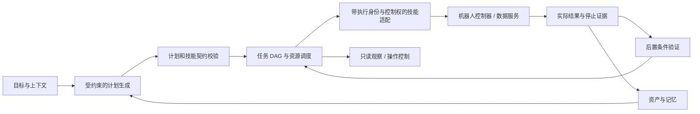

# 机器人 Agent 框架分阶段构建路线

更新日期：2026-09-07。当前执行阶段：**阶段 1，执行权威与恢复闭环**。

本路线负责“按什么顺序构建”；各模块的实时完成情况以 [PROJECT_STATUS.md](PROJECT_STATUS.md) 为准，待决问题与关闭证据以 [OPEN_QUESTIONS.md](OPEN_QUESTIONS.md) 为准。路线不会把测试用文件操作写成机器人验收，也不会用模拟模型结果关闭实际模型工作。

## 构建主线

构建顺序遵循四个约束：先保证旧执行者不能继续影响机器人，再扩大自主规划；先稳定技能和结果契约，再评价模型分解；先取得真实传感器数据，再选择高级记忆后端；先完整管理一台机器人，再引入分布式和多机器人协调。

## 阶段 0：可运行骨架与事实边界

状态：**已完成**。

已形成任务/步骤契约、DAG、资源账本、实际结果判定、持久恢复、本地数据技能、模型 HTTP 适配、多模态资产目录和只读流程 UI。首轮开源调研、依赖锁定、验证记录及 Momo 单项目也已经建立。

退出证据：30 tests、9 subtests、4 项 Chromium 检查和生产构建的既有记录。该阶段只证明软件骨架和实际本地数据链路。

## 阶段 1：执行权威与恢复闭环

状态：**进行中**。这是当前工作重点，不依赖机器人设备即可先完成协议和确定性验证。

1. **历史计划事实完整性——已完成。** 每次修订保存原 plan、steps、catalog、revision、generation 和保存时间；UI 显示对应版本契约，旧账本缺字段时明确标记。
2. **控制权 fencing——下一项。** 为会产生物理副作用的技能增加控制域和单调 fencing token；派发、查询、取消和响应均携带/核对执行权威。控制端必须拒绝旧 token，框架不能仅靠本地 generation 假定旧执行者失效。
3. **补偿与人工接管契约。** 为副作用步骤定义可选补偿技能、触发条件、前置观测、补偿结果和人工处理终态；补偿本身仍是有身份、有资源、有证据的实际执行。
4. **统一重试责任。** 把框架、行为层、驱动和模型的重试预算合并为可追踪策略；任何不可重入动作只查询原 execution ID。
5. **故障矩阵。** 覆盖进程退出、请求超时、迟到响应、取消竞争、控制权换代、补偿失败和结果未知；资源只在可信停止后释放。

退出条件：实际本地 HTTP 执行验证新旧 token；旧执行者不能继续推进副作用；补偿成功、补偿失败和需要人工处理都有持久状态与证据；历史计划可完整复核。这里仍不声称机器人端已采用 fencing。

## 阶段 2：真实机器人技能纵向切片

状态：**未开始**。

1. 建立独立机器人适配包，核心 Runtime 只依赖技能协议，不依赖厂商 SDK、ROS2 Action 或导航实现。
2. 从一项真实、可安全验证的技能开始，完整实现 execute/query/cancel、execution ID、fencing token、资源、超时、停止回执和后置条件。
3. 再覆盖三类契约：只读观测、可取消长动作、独立目标验证；用它们检验框架，而不是在框架内实现导航算法。
4. 配置底盘、手臂、夹爪、传感器、GPU 等实际资源和互斥/容量约束。
5. 在断网、worker 重启、控制换代和人工打断下验证同一执行身份与物理停止。

退出条件：至少一项真实机器人技能完成从提交到最终验证的全链路；成功、失败、取消和未知均来自实际控制器返回及独立观测。硬件急停仍必须走机器人自身安全链路。

## 阶段 3：真实模型长程规划闭环

状态：**未开始**，依赖阶段 2 提供可信技能目录和结果反馈。

1. 接入用户选定的实际模型 endpoint、model 和鉴权环境变量，保存每次原始响应。
2. 向模型只提供冻结技能目录、资源约束、当前状态和可用证据；模型输出计划，不能自行扩权或直接控制机器人。
3. 建立计划评测集，覆盖长程分解、依赖正确性、资源冲突、不可重入动作、失败反馈和有界重规划。
4. 计划先通过确定性契约校验，再进入调度；最终目标由独立验证技能判断。
5. 记录模型拒绝、无效计划、预算耗尽和人工接管，不生成默认成功计划。

退出条件：实际模型至少在多个任务族上产生并执行合法计划；每个结论可以追溯到原始响应、计划版本、技能结果和最终验证，模型自述不作为完成证据。

## 阶段 4：真实多模态数据与长期记忆

状态：**未开始**，现有资产/记录基础继续保留。

1. 接入实际 RGB、深度、点云、TF 和地图 topics，校验时钟、frame、标定、频率与编码。
2. 增加录制队列、背压、磁盘配额、丢帧记录、保留周期、压缩和归档策略。
3. 建立地图/TF/算法版本关系；重定位或回环后使受影响计划和记忆进入失效或待重验状态。
4. 在真实查询集上评估文本索引，再决定是否接入向量库、DimOS memory 或场景图。
5. 实现带来源的分类、矛盾记录、实体合并、有效期和遗忘，不自动覆盖冲突事实。

退出条件：连续真实数据负载下可测量吞吐、延迟、丢帧和磁盘行为；地图版本变化能传播到计划/记忆；检索结果保留资产证据。

## 阶段 5：操作控制与可视化扩展

状态：**未开始**。只读 UI 第一版已经交付。

1. 先定义带身份、权限、幂等键和审计事件的 command API，再增加提交、暂停、取消、恢复和人工接管界面。
2. worker 与机器人分别提供心跳和状态来源；在线、失联、停止确认和 API 可达必须分开显示。
3. 基于实际资产增加 RGB/深度查看和点云/地图渲染，显示 frame、标定和版本，限制解码流量。
4. 完善任务执行/历史分页、查询索引和事件推送；用大规模真实账本验证。
5. 跨机器部署时增加认证代理、最小权限和模型原文访问策略。

退出条件：所有控制请求和实际执行结果在 UI 中分开展示并可审计；可视化只渲染真实资产；断连不会产生误导性在线或成功状态。

## 阶段 6：生产部署与多机器人

状态：**未开始**，在单机器人闭环稳定后推进。

1. 根据实际吞吐和故障目标验证 Postgres、迁移、备份恢复、热升级和高可用。
2. 引入机器人注册、能力目录、任务分配和跨机器人资源模型，保持每台机器人的控制域独立。
3. 实现跨主机租约、fencing、一致性和网络分区策略；不以租约过期推断物理停止。
4. 验证机器人掉线、部分队伍不可用、任务转移和协同任务的恢复边界。

退出条件：单机功能在生产持久化后端上保持一致；多机器人任务和资源冲突有实际运行证据；单机器人仍可独立降级运行。

## 阶段 7：场景验收

状态：**未开始**。

完全陌生未建图环境中的自主探索和目标趋向导航作为首个长程验收场景。此阶段组合前述计划、资源、技能、打断、恢复、地图版本、记忆和 UI 能力；探索算法与导航执行由下层技能提供。

退出条件按场景另行定义实际测量：目标完成、覆盖/发现、资源冲突、导航拒止、定位丢失、恢复次数、人工打断响应和数据证据完整性。场景通过只关闭对应验收项，不自动代表所有机器人任务族完成。

## 当前下一步

下一项代码工作是阶段 1 的控制权 fencing。实施时先扩展技能注册契约和持久执行记录，再扩展 HTTP 协议与参考数据服务，最后用两个先后控制版本驱动同一实际分块文件操作，验证旧版本不能继续写入。通过后再进入补偿契约。
