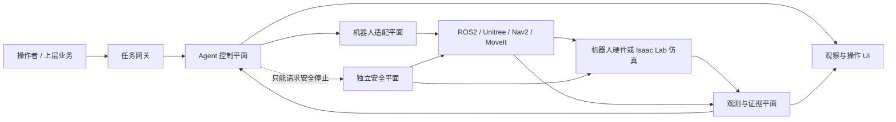
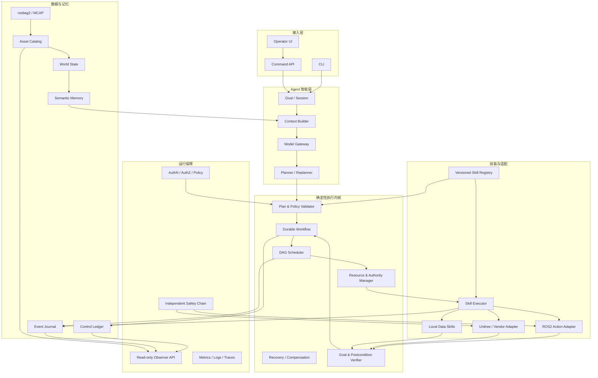
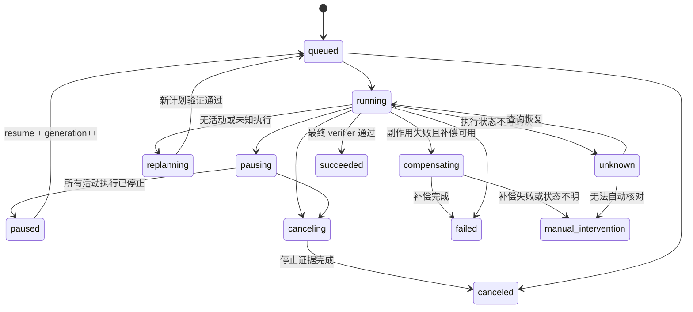
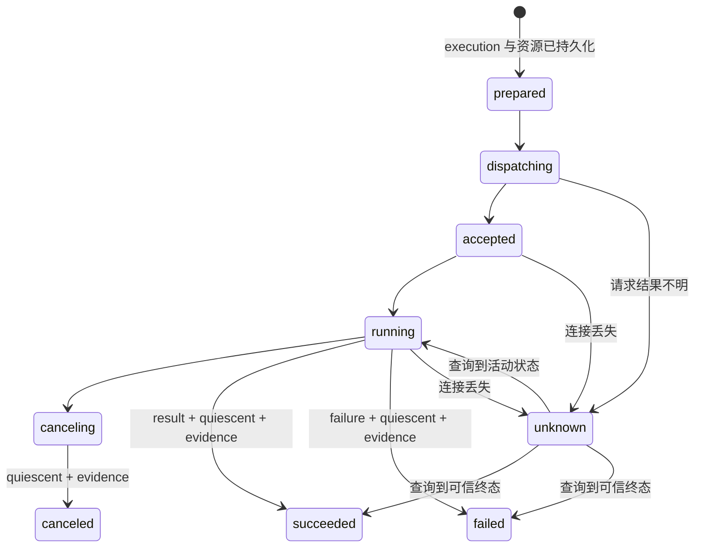
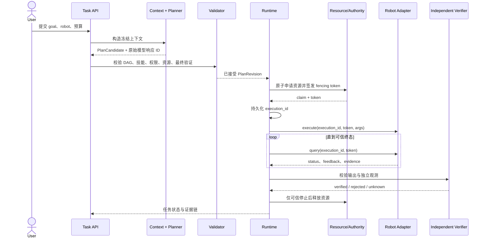
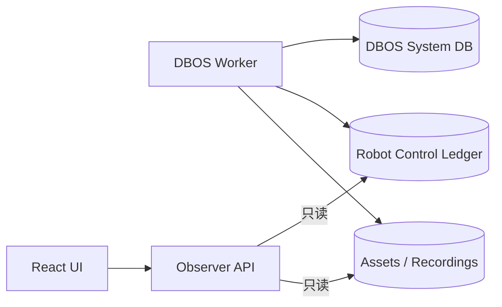

# 机器人 Agent 框架详细架构

更新日期：2026-09-08  
架构状态：目标架构（部分已实现）  
适用范围：`robot_agent_framework/`，单机器人优先，预留多机器人扩展  
状态依据：[PROJECT_STATUS.md](PROJECT_STATUS.md)  
现有执行契约：[ARCHITECTURE.md](ARCHITECTURE.md)  
分阶段建设顺序：[BUILD_ROADMAP.md](BUILD_ROADMAP.md)

本文把用户提出的长程任务分解、原子技能、失败 fallback、打断恢复、多资源、多模态记忆和真实证据要求，细化为可实施的系统边界。本文描述完整目标，不代表所有模块已经交付；每一项实际完成情况仍以 `PROJECT_STATUS.md` 为准。

## 1. 架构结论

本工程采用“模块化控制平面 + 机器人适配平面 + 证据数据平面 + 独立安全平面”的总体结构。第一阶段保持单进程、单机器人和清晰的状态所有权；接口设计允许后续把模型调用、机器人适配器、资产服务和多机器人调度拆成独立进程。

最重要的控制原则是：

> 大模型可以提出计划，但不能直接获得机器人执行权；Runtime 决定计划是否合法、何时派发以及何时结束；机器人控制端决定命令能否作用于硬件；独立观测决定物理目标是否真正完成。

系统按时间尺度分成三层：

| 时间尺度 | 典型组件 | 职责 | 不负责 |
|---|---|---|---|
| 秒至分钟 | LLM、目标解释、DAG 规划、重规划 | 处理开放目标和不确定任务分解 | 实时闭环控制、直接发布速度或关节命令 |
| 毫秒至秒 | Runtime、调度器、资源和技能协议 | 确定性校验、持久状态、执行身份、控制权和恢复 | 伪造物理完成、替代硬件急停 |
| 亚毫秒至毫秒 | ros2_control、厂商控制器、安全 PLC/MCU | 实时控制、限幅、状态采样和硬件保护 | 长程任务规划、语义记忆 |

这三个时间尺度不能由同一个 Agent 循环承担。

## 2. 用户目标和设计约束

### 2.1 已确认目标

- 建设通用机器人 Agent 框架，而不是只实现一个导航或抓取算法。
- 支持长程任务分解、动态修订、原子技能、fallback、打断和恢复。
- 第一版完整管理单台机器人的多个任务和多种资源。
- 保存和管理 RGB、深度、点云、TF、点云地图、占据地图和体素地图。
- 模型、技能、传感器和机器人结果必须来自实际调用；不得以占位或模拟结果冒充现场完成。
- 尽量复用成熟开源组件，但本工程必须掌握跨组件执行契约和状态所有权。
- 陌生环境探索与目标趋向导航是最终组合验收场景，不侵入框架核心。

### 2.2 当前工程事实

当前已经实现 DAG、冻结技能目录、SQLite 控制账本、DBOS 恢复、本地和 HTTP 技能、资源容量、暂停/取消/恢复、计划历史、模型调用、基础资产目录、MCAP/rosbag2 和只读 UI。`qwen3.8-max` 已有一次实际两步规划响应和契约接受记录，但没有对应执行闭环。

当前关键缺口是控制端 fencing、补偿和人工接管、真实 ROS2/Unitree 技能、任务族独立验证、多模态现场流、地图失效传播、生产部署和多机器人。这些缺口决定下面目标架构的实施顺序。

## 3. 系统上下文



### 3.1 四个平面

| 平面 | 权威数据 | 主要模块 | 关键边界 |
|---|---|---|---|
| Agent 控制平面 | Task、PlanRevision、Step、Execution、ResourceClaim、ControlRequest | Planner、Validator、Runtime、Scheduler、Policy | LLM 输出永远是不可信候选输入 |
| 机器人适配平面 | 远端执行身份、控制器状态、动作反馈 | Skill Adapter、ROS2 Action Client、厂商 SDK Bridge | 适配协议，不在此重新解释高层目标 |
| 证据数据平面 | Observation、Evidence、Asset、MapVersion、MemoryFact | Recorder、Asset Catalog、Verifier、World State | 大文件不进入任务 JSON；事实必须可追溯 |
| 独立安全平面 | 急停、限速、碰撞区、硬件状态 | PLC/MCU、驱动保护、Collision Monitor、Watchdog | 不依赖 LLM、Runtime、数据库或公网 |

## 4. 逻辑组件架构



### 4.1 接入层

接入层负责接收目标和控制请求，不直接触碰机器人：

- `Goal API`：提交目标、机器人、优先级、预算、截止时间和确认策略。
- `Plan API`：提交操作者提供的确定性计划。
- `Command API`：暂停、取消、恢复、接管和确认危险动作。
- `Query API`：查询任务、事件、资源、资产、模型响应和验证证据。
- `Model Test API`：保持为独立测试入口，不能与生产 Task API 共用成功语义。

所有写请求都应带用户身份、权限、请求幂等键和原因；控制请求与控制结果必须作为两个事件展示。

### 4.2 Agent 智能层

智能层由四个可替换部件组成：

1. `GoalSession`：管理目标、对话和人工澄清，不管理物理执行状态。
2. `ContextBuilder`：选择冻结技能目录、资源快照、世界状态、历史结果和相关记忆。
3. `ModelGateway`：管理模型配置、鉴权、超时、限流、原始响应和调用成本。
4. `Planner`：输出受 Schema 约束的 `PlanCandidate`，重规划时只读取账本里的已确认事实。

当前 `ModelCaller`、`ContextAllocator` 和 `Planner` 可以分别演进到上述边界。会话历史、摘要和记忆检索尚未实现，因此不能在架构图中标记为已接通。

### 4.3 确定性执行内核

执行内核是本项目必须自行掌握的最小协调层：

- `PlanValidator`：检查 DAG、技能版本、Schema、资源、引用、预算和最终验证节点。
- `PolicyEngine`：检查操作者权限、机器人能力、安全等级和是否需要人工确认。
- `DurableWorkflow`：负责长任务恢复和等待；非确定性 IO 必须位于可记录边界。
- `DAGScheduler`：只派发依赖成功、资源可得并且权威有效的步骤。
- `ResourceManager`：原子获取资源，未知执行继续占用。
- `AuthorityManager`：为每个控制域签发单调 fencing token，阻止旧执行者继续作用。
- `RecoveryCoordinator`：区分 retry、fallback、replan、compensate 和 manual intervention。
- `Verifier`：用独立观测判断技能后置条件和最终目标。

DBOS 负责工作流恢复，业务账本负责机器人任务、执行身份和控制资源。两者不能分别维护一套相互竞争的任务真相。

### 4.4 技能和适配层

技能是规划层唯一允许调用的机器人能力。技能注册表按 `name + version` 冻结，任务创建后保存对应快照。

目标技能契约：

```yaml
name: navigation.goto
version: 1.0.0
adapter: ros2_action
endpoint: /navigate_to_pose
input_schema: {}
output_schema: {}
resources:
  base: 1
control_domain: locomotion
permissions: [robot.motion]
cancelable: true
replay_policy: query_only_after_dispatch
timeouts:
  request_s: 5
  execution_s: 300
preconditions: []
invariants: []
postconditions: []
evidence_requirements: []
fallbacks_allowed: []
compensation_skill: navigation.safe_stop
verifier: navigation.pose_verifier
```

`replay_policy` 建议替代单一 `replay_safe` 布尔值：

| 策略 | 含义 | 示例 |
|---|---|---|
| `pure` | 可任意重算，无外部副作用 | 坐标转换 |
| `idempotent` | 同一业务键重复执行结果一致 | 写入幂等配置 |
| `query_only_after_dispatch` | 一旦可能发出，只能查询原执行 | 导航、抓取 |
| `manual_reconcile` | 无法可靠查询，需要人工核对 | 未改造的旧设备接口 |

### 4.5 ROS2 和厂商适配器

接口选择遵循 ROS2 的主流语义：

- Topic：连续传感器、机器人状态、反馈和事件。
- Service：快速、无长时间副作用的查询或配置。
- Action：导航、抓取、建图等长动作，必须提供反馈和取消。
- Lifecycle：驱动、感知、定位、导航等组件的配置、激活、停用和错误状态。

框架侧统一使用执行协议，ROS2 适配器负责把它映射到 Action goal UUID、反馈、result 和 cancel。`execution_id` 必须能够反查 Action goal；Action server 的 result 仍需经过本项目 Verifier，不能自动等价为业务完成。

目标执行请求至少包含：

```json
{
  "execution_id": "uuid",
  "task_id": "uuid",
  "plan_revision": 2,
  "generation": 4,
  "robot_id": "g1-01",
  "skill": "navigation.goto@1.0.0",
  "control_domain": "locomotion",
  "fencing_token": 73,
  "idempotency_digest": "sha256:...",
  "deadline": "RFC3339 timestamp",
  "args": {}
}
```

目标执行响应至少包含：

```json
{
  "execution_id": "uuid",
  "fencing_token": 73,
  "state_seq": 18,
  "status": "running|succeeded|failed|canceling|canceled|unknown",
  "quiescent": false,
  "controller_instance": "nav-adapter-boot-id",
  "observed_at": "RFC3339 timestamp",
  "output": {},
  "evidence": []
}
```

控制端必须拒绝低于当前控制域 token 的 start、update 和 cancel 请求。只在 Runtime 检查 generation 不足以阻止旧进程继续向硬件发送命令。

### 4.6 证据、世界状态和记忆

数据分为五种，不使用一个“Memory”概念混装：

| 数据类型 | 内容 | 推荐存储 | 更新方式 |
|---|---|---|---|
| Control facts | 任务、计划、执行、资源、控制请求 | 事务数据库 | Runtime 单写者语义 |
| Event journal | 状态变化、原因、模型和人工操作 | 追加事件表 | 只追加 |
| Raw observation | RGB、深度、点云、TF、控制反馈 | rosbag2/MCAP/对象存储 | 流式写入和分片 |
| Asset catalog | 哈希、格式、时空、标定、地图版本 | SQL 元数据 | 内容寻址、不可变资产 |
| Derived knowledge | 对象、关系、摘要、经验 | SQL/FTS；证明确有需要后再加向量或图 | 保留来源、有效期和冲突 |

任何空间事实都应携带 `robot_id`、`frame_id`、`clock_domain`、`timestamp_ns`、`calibration_id`、`map_version` 和来源资产。地图回环、重定位或 TF 基准变化后，相关事实进入 `stale` 或 `needs_reverification`，不能静默覆盖。

### 4.7 独立安全平面

安全平面至少分三层：

1. 硬件急停、驱动使能、力矩和关节限制，独立于上层软件。
2. 控制器级限幅、碰撞检测、Watchdog 和失联停车。
3. Agent 策略级权限、危险区域、动作确认和资源冲突检查。

Nav2 Collision Monitor 作为低于导航规划器的独立速度过滤节点，是本工程安全分层的直接参考。Agent 的 `cancel`、控制器的 `safe stop` 和硬件 `e-stop` 必须是三个不同概念和接口。

## 5. 核心领域模型与状态所有权

### 5.1 核心对象

| 对象 | 唯一身份 | 权威所有者 | 说明 |
|---|---|---|---|
| Goal | `goal_id` | GoalSession | 用户意图及约束 |
| Task | `task_id` | Runtime | 一个可持续恢复的任务实例 |
| PlanRevision | `task_id + revision` | Runtime | 不可变的计划版本 |
| Step | `task_id + revision + step_id` | Runtime | DAG 节点 |
| SkillSpec | `name + version` | SkillRegistry | 冻结能力契约 |
| Execution | `execution_id` | Runtime 与适配器各保存对应状态 | 一次外部副作用尝试 |
| AuthorityEpoch | `robot_id + control_domain + token` | AuthorityManager | 控制域当前权威 |
| ResourceClaim | `execution_id + resource` | ResourceManager | 资源占用 |
| ControlRequest | `command_id` | Command API / Runtime | pause、cancel、takeover 请求 |
| Evidence | `evidence_id` | EvidenceCatalog | 支持状态结论的观测或记录 |
| Asset | `asset_id + sha256` | AssetCatalog | 不可变数据资产 |
| MemoryFact | `fact_id + revision` | MemoryStore | 带来源和有效期的派生事实 |

### 5.2 任务状态机

当前状态保持兼容；目标架构增加补偿和人工状态：



其中 `unknown` 不是普通失败：不得释放资源、重发动作或触发另一个可能冲突的 fallback。

### 5.3 执行状态机



## 6. 关键运行流程

### 6.1 正常任务流程



### 6.2 暂停、取消与抢占

1. Command API 持久化控制请求，不能直接把 Task 改为 `paused/canceled`。
2. Runtime 阻止新步骤派发，并向每个活动 execution 发送带当前 token 的 cancel。
3. 适配器请求 Action/控制器停止，持续返回 `canceling`。
4. 只有控制器状态、速度/关节观测和必要的持物状态满足停止契约，才返回 `quiescent=true`。
5. Runtime 释放资源并进入 `paused/canceled`。
6. 抢占者只能在上述过程完成后获得相同控制域的新 token。

高优先级不等于立即获得物理控制权。

### 6.3 崩溃恢复

1. DBOS 恢复对应 workflow。
2. Runtime 从业务账本读取 Task、PlanRevision、Execution、资源和 token。
3. 已存在 execution 时只调用 `query`，不重新 `execute`。
4. 如果远端找不到 execution，状态保持 `unknown`；不能据此推断原动作未发生。
5. 如果当前控制端 token 已推进，旧 execution 标记为失去权威，但仍需确认物理状态。
6. 只有状态完成核对后才能继续、补偿或请求人工处理。

DBOS 的工作流幂等性不能自动转化为机器人副作用幂等性。

### 6.4 失败决策顺序

失败后的决策必须只有一个权威入口，建议固定顺序：

```text
query original execution
  -> still running: wait or cancel
  -> unknown: hold resources and reconcile
  -> failed + not quiescent: safe-stop
  -> failed + quiescent:
       retry（只有契约允许）
       或 fallback（仍满足原步骤后置条件）
       或 compensate（处理已经发生的副作用）
       或 replan（所有旧动作停止后）
       或 manual_intervention
```

驱动、行为树、Runtime 和 LLM 不能各自独立重试同一副作用。

## 7. 具体案例：G1 将红色方块放入抽屉

这个案例对应仓库已有 G1 抓取/放置任务族，可作为第一条完整纵向切片。它不是当前已通过的机器人验收。

### 7.1 目标计划


### 7.2 资源设计

| 步骤 | 资源 | 控制域 | 可取消 | 恢复策略 |
|---|---|---|---|---|
| scene.observe | head_camera、GPU | perception | 是 | 可重新观测 |
| body.approach | base 或 whole_body | locomotion | 是 | 查询原执行，停止后重规划 |
| arm.pregrasp | arm、workspace | manipulation | 是 | 查询原执行 |
| gripper.grasp | gripper、arm | manipulation | 取决于阶段 | 持物后不得盲目重放 |
| arm.move_to_drawer | arm、gripper、workspace | manipulation | 是 | 必须保存持物状态 |
| gripper.release | gripper | manipulation | 通常不可逆 | 独立验证后决定补偿 |
| verify.block_in_drawer | camera、GPU | perception | 是 | 多视角或人工核对 |

### 7.3 成功证据

最终成功至少要求：

- `execution_id` 和 fencing token 与当前任务匹配；
- 所有动作终态具有可信停止证据；
- 抽屉内区域的目标检测或点云分割结果引用实际图像/点云资产；
- 目标物体连续若干帧位于抽屉空间范围内；
- 夹爪已释放且机械臂退出危险区域；
- 所有证据带相同或可转换的时间、坐标系、标定和地图版本。

“模型回答已完成”“Action 返回 succeeded”或“夹爪已经张开”都不能单独证明任务完成。

### 7.4 失败与补偿示例

- 抓取失败且机械臂已停止：允许重新观测后有限次重试。
- 抓取成功但移动途中失联：资源保持占用，查询原 execution，禁止再次抓取。
- 物体掉落：保存掉落观测，撤回到安全姿态，再重规划。
- 释放后无法看到物体：进入 `unknown`，换视角验证；不能直接再次释放。
- 机械臂无法停止：调用控制器安全停止并请求人工接管；软件任务不能标记 canceled。

### 7.5 仿真与真机的一致接口

Isaac Lab 和真机应实现同一 SkillSpec 与执行状态语义，但 `provider` 和 `evidence_level` 不同：

```text
provider = isaaclab | ros2 | unitree_sdk
evidence_level = simulation | software_integration | hardware_observation
```

仿真通过可以关闭契约和算法问题，不能自动关闭硬件停止、时延、碰撞、标定和真实目标完成问题。

## 8. 主流架构的借鉴与边界

| 案例 | 借鉴机制 | 本项目落点 | 明确不照搬的部分 |
|---|---|---|---|
| ROS2 Interfaces | Topic/Service/Action 分工；Action 支持长动作反馈和取消 | ROS2 Skill Adapter | Action succeeded 不直接等价于任务成功 |
| ROS2 Managed Nodes | 外部监督者管理 configure/activate/deactivate/error | Robot Runtime Supervisor | 不把节点生命周期和 Task 状态合并 |
| Nav2 BT Navigator | 用行为树组织导航行为和恢复插件 | 单个导航技能内部 | 不让 Nav2 BT 成为全局多任务账本 |
| Nav2 Collision Monitor | 独立于规划器的速度过滤和传感器超时停车 | 安全平面 | 不把它声明为硬件急停 |
| MoveIt Task Constructor | 用 Stage 分解相互依赖的操作规划子任务 | manipulation 技能内部 | 不替代跨任务资源和持久恢复 |
| Open-RMF | Dispatcher、能力、资源成本和 Fleet Adapter | 阶段 6 多机器人适配 | 单机器人阶段不提前引入竞价和交通协商 |
| DBOS | 持久 workflow、唯一 ID、恢复、队列与并发控制 | DurableWorkflow | 不假设软件 step 恢复保证物理动作 exactly-once |
| rosbag2 / MCAP | 原始消息记录、回放和可索引证据 | Recording + Asset Catalog | 不把录制文件当成语义记忆本身 |

参考资料：

- [ROS2 Topic、Service、Action 的接口分工](https://docs.ros.org/en/rolling/Concepts/Basic/Interfaces-Topics-Services-Actions.html)
- [ROS2 Action 的长任务、反馈和取消语义](https://docs.ros.org/en/rolling/Concepts/Basic/About-Actions.html)
- [ROS2 Managed Node 生命周期设计](https://design.ros2.org/articles/node_lifecycle.html)
- [Nav2 Behavior-Tree Navigator](https://docs.nav2.org/jazzy/configuration_and_development/configuration_guide/core_servers/configuring_bt_navigator/)
- [Nav2 Collision Monitor](https://docs.nav2.org/rolling/configuration_and_development/configuration_guide/core_servers/collision_monitor/)
- [MoveIt Task Constructor](https://moveit.picknik.ai/main/doc/concepts/moveit_task_constructor/moveit_task_constructor.html)
- [Open-RMF Fleet Adapter](https://osrf.github.io/ros2multirobotbook/integration_fleets_adapter_tutorial.html)
- [Open-RMF 任务分配](https://osrf.github.io/ros2multirobotbook/task.html)
- [DBOS 持久工作流](https://docs.dbos.dev/python/tutorials/workflow-tutorial)
- [DBOS 队列与并发](https://docs.dbos.dev/python/tutorials/queue-tutorial)
- [MCAP 格式规范](https://mcap.dev/spec)

这些链接说明借鉴机制；具体版本兼容性仍需以本项目 ROS2 Humble、Python 3.10 和锁定依赖单独验证。

## 9. 数据库和状态所有权

### 9.1 当前单机部署



- DBOS System DB：工作流历史和恢复位置。
- Robot Control Ledger：任务、计划、执行、控制、资源和业务事件。
- 文件/对象存储：大体积观测、录制和派生资产。
- Observer：只读访问，不导入 Runtime，不创建缺失账本。

### 9.2 生产演进

生产阶段可以迁移到 Postgres 和对象存储，但必须先通过迁移、备份恢复、网络分区和吞吐验证。拆分服务后仍坚持：每类状态只有一个写入权威，其他组件通过事件或版本化 API 获取副本。

建议使用 Outbox 模式发布账本事件，避免“数据库已提交但消息未发送”或反向不一致。事件至少包含 `event_id`、`task_id`、`execution_id`、`generation`、`state_seq`、`occurred_at`、`observed_at` 和 `source`。

## 10. 部署视图

### 10.1 当前推荐拓扑

```text
Operator Host
├── robot-agent CLI / API
├── DBOS worker
├── SQLite control ledger
├── observer API
└── React UI

Robot Compute
├── robot skill gateway
├── ROS2 action adapters
├── perception / navigation / manipulation nodes
├── rosbag2 recorder
├── controller watchdog
└── independent safety chain

Storage
└── recordings / assets / maps / calibration
```

第一条真机纵向切片可以仍在单主机完成，但 Skill Gateway 必须保持进程边界和持久执行身份，以便真正验证断连、重启和旧 token 拒绝。

### 10.2 多机器人拓扑

多机器人阶段再增加：

- Robot Registry 与能力目录；
- 每台机器人独立的控制域和 fencing 序列；
- Fleet Scheduler 与任务分配成本；
- 跨主机持久数据库和事件总线；
- 地图/交通资源协调；
- 网络分区和机器人自主降级策略。

Open-RMF 的 Fleet Adapter 适合作为导航型多机器人和建筑设施协调参考，但不应替代本项目的通用技能、证据和补偿契约。

## 11. 安全和权限模型

| 主体 | 可执行操作 | 禁止操作 |
|---|---|---|
| LLM Planner | 从冻结技能目录选择技能并填写参数 | 创建新权限、任意端点、直接控制 topic |
| Runtime | 校验、调度、持久化、请求执行和停止 | 绕过控制端 fencing、声明硬件急停成功 |
| Skill Adapter | 转换协议、维护远端执行身份 | 修改高层目标、绕过资源授权 |
| Robot Controller | 执行当前有效 token 对应命令 | 接受旧 token 或未知控制域命令 |
| Verifier | 根据观测给出 verified/rejected/unknown | 发起物理动作 |
| Operator | 在权限范围内提交、确认、暂停、取消和接管 | 无审计修改历史事实 |

敏感信息只保存环境变量名或密钥引用，不进入 Momo、模型上下文、任务事件或浏览器响应。跨机器部署必须增加 TLS、服务身份、最小权限和模型原文访问策略。

## 12. 可观测性

UI 应分别展示：

- API 是否可达；
- worker 是否有心跳；
- robot adapter 是否有心跳；
- 机器人控制器和安全链状态；
- Task/Step/Execution 状态及其状态来源；
- 当前 fencing token 和资源持有者；
- 控制请求与实际停止结果；
- 计划 revision、generation 和技能目录版本；
- 模型原始响应、解析结果和拒绝原因；
- 证据资产、地图/TF/标定版本；
- unknown、stale、manual intervention 等风险状态。

“API 在线”“worker 在线”“机器人在线”“机器人已经停止”必须是四个不同指标。

## 13. 测试与验收架构

### 13.1 测试分层

| 层级 | 验证对象 | 允许替身 | 不能证明 |
|---|---|---|---|
| 单元测试 | Schema、DAG、状态转换、资源算法 | 纯内存输入 | 外部服务或机器人真实完成 |
| 契约测试 | HTTP/ROS2 Adapter、SkillSpec、Evidence | 协议测试服务 | 物理目标完成 |
| 故障注入 | 崩溃、超时、迟到响应、token 换代 | 实际进程和本地服务 | 硬件动力学安全 |
| 仿真验收 | Isaac Lab 中的导航/操作闭环 | 仿真传感器和机器人 | 真机时延、标定和停止能力 |
| 真机纵向切片 | 一项真实技能的 execute/query/cancel/verify | 不允许伪结果 | 其他任务族 |
| 场景验收 | 陌生环境探索和目标趋向 | 真实模型与实际机器人 | 未覆盖的生产规模和多机故障 |

### 13.2 必须覆盖的故障矩阵

- execution 记录后、请求发送前崩溃；
- 请求已到控制器、响应丢失；
- worker 重启后查询原 execution；
- cancel 与成功结果同时到达；
- 自动重规划与用户取消同时到达；
- 旧 worker 或旧 adapter 在新 token 签发后继续发送；
- 控制器报告终态但机器人仍在运动；
- 补偿动作失败；
- 传感器时间戳、TF 或地图版本不匹配；
- 磁盘满、录制背压和部分资产损坏；
- 模型超时、非法 JSON、未知技能和上下文超预算；
- 网络分区后机器人状态为 unknown。

## 14. 代码包演进建议

保持现有可运行代码，逐步拆分而非一次性重写：

```text
robot_agent_framework/
├── robot_agent/
│   ├── agent/                 # GoalSession、ContextBuilder、Planner
│   ├── contracts/             # Task、Plan、Skill、Result、Evidence
│   ├── runtime/               # workflow、scheduler、recovery
│   ├── authority/             # control domain、fencing、resource claims
│   ├── skills/                # registry、executor、verifier
│   ├── adapters/              # HTTP、ROS2、Unitree、Isaac Lab
│   ├── data/                  # assets、recording、world state、memory
│   ├── persistence/           # ledger repositories、migration、outbox
│   └── interfaces/            # CLI、command/query API
├── robot_agent_observer/      # 保持只读
├── robot_skill_gateway/       # 机器人侧执行身份与 token 拒绝
├── ui/
├── configs/
│   ├── robots/
│   ├── skills/
│   ├── resources/
│   ├── policies/
│   └── recording/
├── deployment/
├── tests/
│   ├── unit/
│   ├── contracts/
│   ├── integration/
│   ├── fault_injection/
│   ├── simulation/
│   └── hardware/
└── docs/
```

现在不应立即按此目录机械搬迁文件。应在每个阶段为新增职责建立边界，等原 `runtime.py`、`skills.py` 或 `store.py` 出现稳定接口后再迁移，避免无功能收益的重构。

## 15. 从当前状态到目标架构

| 顺序 | 架构增量 | 主要交付物 | 退出证据 |
|---|---|---|---|
| 1 | Execution Authority | control domain、fencing token、机器人侧拒绝旧 token | 两个先后控制版本操作同一实际本地副作用，旧版本被拒绝 |
| 2 | Recovery Contract | 补偿、人工处理、统一重试决策 | 补偿成功、失败和 unknown 均有持久证据 |
| 3 | Robot Skill Gateway | ROS2 Action execute/query/cancel、Lifecycle 健康 | 至少一项实际机器人技能完整闭环 |
| 4 | Independent Verification | 导航/抓取任务族 verifier 和测量阈值 | Action 结果与独立观测分别记录 |
| 5 | Long-horizon Agent | 会话/上下文、长 DAG、失败反馈重规划评测 | 多任务族实际模型规划与执行 |
| 6 | Multimodal Evidence | 实际 RGB-D/点云/TF、背压、地图失效 | 连续负载和版本传播验证 |
| 7 | Operator Control | 鉴权 Command API、心跳、接管和数据预览 | 控制请求与真实结果全链路审计 |
| 8 | Production & Fleet | Postgres、对象存储、多机器人适配 | 故障注入、迁移恢复和多机资源冲突验证 |

这与 `BUILD_ROADMAP.md` 保持一致。当前下一项仍应是 fencing，而不是增加多 Agent 角色或默认安装向量数据库、场景图、Open-RMF 和完整行为树。

## 16. 暂不采用的设计

- 不采用 LLM 直接发布 ROS2 topic 或厂商 SDK 命令。
- 不让 LangGraph、行为树、DBOS 和 Runtime 同时成为全局任务状态机。
- 不把 Action 的 `succeeded`、RPC 2xx 或模型文字结论当作最终成功。
- 不因租约超时自动释放可能仍在运动的物理资源。
- 不把所有历史、点云和地图写入向量数据库。
- 不在单机器人控制闭环未完成前引入多 Agent 协商和分布式微服务。
- 不让仿真证据覆盖真机未验证项。

## 17. 架构完成判据

完整框架至少要能对一次真实长程任务回答以下问题：

1. 谁提出了当前计划，使用了哪些上下文和技能版本？
2. 谁批准了计划，为什么它有权限执行？
3. 每个副作用对应哪个 execution ID 和 fencing token？
4. 当前谁持有底盘、手臂、夹爪和共享算力？
5. 崩溃恢复后是否只查询原执行，而没有重复动作？
6. 取消后机器人何时真正停止，证据是什么？
7. 成功由哪个独立 verifier 判定，引用了哪些观测？
8. 地图、TF、标定或对象事实发生变化时，哪些计划和记忆失效？
9. 自动恢复失败时，系统如何进入补偿或人工接管？
10. UI 展示的每个结论能否追溯到实际账本、控制器或资产？

如果其中任何关键问题只能由模型自述回答，该能力就还没有达到完整架构的验收标准。
