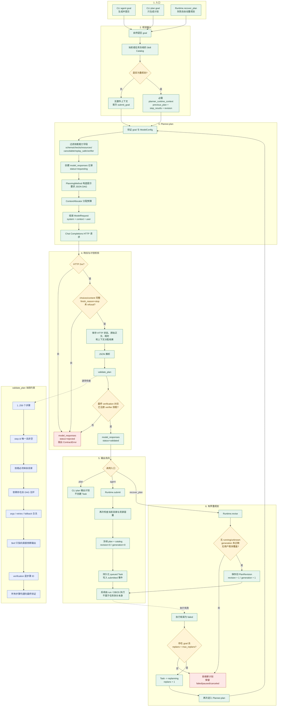
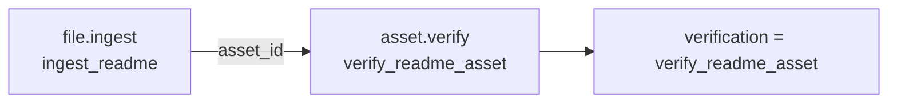

# 当前 Agent 任务拆分流程

更新日期：2026-09-11  
范围：当前已经实现的 `robot_agent_framework` 任务规划与重规划路径  
详细模型调用：[MODEL_CONTEXT_FLOW.md](MODEL_CONTEXT_FLOW.md)  
完整目标架构：[DETAILED_ARCHITECTURE.md](DETAILED_ARCHITECTURE.md)

本文只描述当前代码实际行为，不把目标架构中的会话记忆、递归子任务、在线计划修补或机器人闭环标成已实现。可直接打开的矢量图见 [task_decomposition_current.svg](diagrams/task_decomposition_current.svg)，Graphviz 源文件见 [task_decomposition_current.dot](diagrams/task_decomposition_current.dot)。

## 总流程



## 当前一次规划的准确调用链

```text
CLI agent
  -> Runtime.submit_goal(goal, robot_id, model_config, priority, max_replans)
     -> Runtime.catalog()
     -> Planner.plan(goal, catalog)
        -> ModelCaller(config)
        -> PlanningMethod.prepare({goal, skills})
        -> ContextAllocator.allocate(...)
        -> ChatCompletionsTransport.send(...)
        -> ModelCaller 校验 HTTP 和响应结构
        -> json.loads(content)
        -> validate_plan(plan, catalog)
        -> 检查最终步骤的 SkillSpec.verifier
        -> 保存 model_responses 证据
     -> Runtime.submit(plan, ...)
        -> 再次读取当前 catalog
        -> 校验技能重试安全性和资源容量
        -> 冻结 plan 与 catalog
        -> 创建 queued Task
```

`CLI plan` 到 `Planner.plan` 为止，只输出计划；`CLI agent` 才把通过校验的计划提交成 Task。

## 模型实际收到的任务拆分约束

当前 `PlanningMethod` 要求模型：

- 只返回 `{"steps":[...],"verification":"step_id"}` JSON 对象；
- 每个步骤使用冻结目录里的技能；
- 用 `deps` 表示依赖并形成可执行 DAG；
- 用 `{"$ref":"dependency_id.output_field"}` 引用直接依赖的真实输出；
- 可声明 `retries` 和 `fallback`，但均有数量上限；
- 最终 `verification` 必须是独立目标验证步骤的字符串 ID；
- 技能目录无法表达或验证目标时返回错误，不得创造观测、技能或成功结果。

模型看不到技能的 endpoint、token 或任意执行权限，只接收以下能力字段：

```text
input_schema
output_schema
checks
resources
cancelable
replay_safe
verifier
```

## 首次规划与重规划的区别

| 项目 | 首次 `submit_goal` | 自动 `recover_plan` |
|---|---|---|
| 目标 | 新 goal | 原 Task goal |
| 技能目录 | 当前 catalog | Task 冻结 catalog 用于模型规划 |
| 运行上下文 | 当前默认不注入 | `previous_plan`、`step_results`、`revision` |
| 上下文优先级 | 无 | required、priority=100 |
| 预算 | `max_replans` 只保存到 Task | 每次尝试先消费一次预算 |
| 接受路径 | `Runtime.submit` | `Runtime.revise` |
| 并发保护 | 创建新 Task | 检查 expected generation；用户取消优先 |
| 副作用保护 | 依赖 SkillSpec | 修订计划要求所选技能均为 `replay_safe` |

重规划只在任务已经失败、没有仍在运行或 unknown 的执行时接受。它不是在某个运行步骤中动态插入新节点。

## 实际验证过的示例

2026-09-07 的实际 `qwen3.8-max` 请求生成并通过了以下两步计划：



该证据只证明真实模型响应、JSON 解析、DAG/引用和最终 verifier 契约通过。记录明确标记 `plan_executed=false`，因此不证明计划执行或机器人任务完成。

## 当前没有发生的流程

以下能力尚未接入当前任务拆分链：

- 没有连续对话 Session 自动参与规划；
- 没有从资产目录或语义记忆自动检索上下文；
- 没有边执行边递归创建子 Task；
- 没有根据实时世界状态持续改写 DAG；
- 没有 Planner/Executor/Critic 多 Agent 协商；
- 没有让模型直接执行技能或 ROS2 命令；
- 没有真机任务族的长程规划质量评测；
- 自动重规划框架已有软件测试，但没有外部模型加机器人执行闭环验收。

因此，当前最准确的定义是：

> **一次性受约束 DAG 生成 + 确定性双层校验 + 失败后有界整计划修订。**

## 代码证据

- `robot_agent/cli.py`：`agent`、`plan`、`replan` 三个入口。
- `robot_agent/runtime.py`：`submit_goal`、`submit`、`recover_plan`、`revise` 和失败转 `replanning`。
- `robot_agent/planner.py`：技能能力裁剪、模型证据记录、JSON/DAG 和 verifier 校验。
- `robot_agent/model_methods.py`：任务拆分提示与 JSON 输出格式。
- `robot_agent/model_call.py`：方法、上下文、请求和响应校验的组合。
- `robot_agent/model_context.py`：必需/可选上下文预算分配。
- `robot_agent/model_transport.py`：无状态 Chat Completions HTTP 调用。
- `robot_agent/contracts.py`：DAG、依赖、引用、fallback 和最终验证约束。
- `docs/validation/model-planning-qwen3.8-max.json`：实际模型两步规划证据及验收边界。
